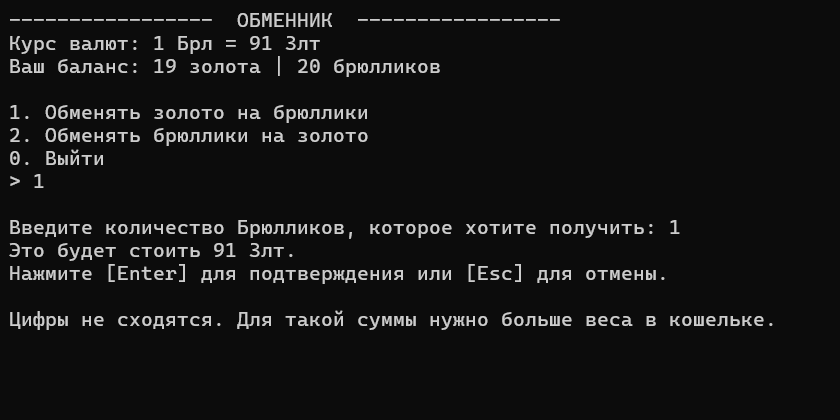

<h1 align="center">InventoryApp</h1>

<p align="center">
  Консольная система управления инвентарем и игровой экономикой с интеграцией реальных рыночных данных.<br>
  Проект демонстрирует применение архитектурных стандартов платформы .NET для создания надежных и расширяемых систем.
</p>
<br>
<p align="center">
  
  
</p>
<br>

## Функционал
* **Инвентарь:** Просмотр предметов, их описания и учёт количества.
* **Торговые площадки:** Магазин для покупки предметов и Ломбард для их продажи с автоматическим расчетом стоимости.
* **Гринд:** Механика случайного заработка игровой валюты, имитирующая игровую активность.
* **Обменник (Real-time):** Конвертация Золота в Брюллики и обратно. Актуальный курс рассчитывается на основе реальной цены BTC/USDT, получаемой через REST API биржи Binance.

## Технологический стек
* **Runtime:** .NET 9 (C# 13).
* **Data:** Entity Framework Core (Code First), MS SQL Server (LocalDB).
* **Architecture:** Dependency Injection (Microsoft.Extensions.Hosting). Хост управляет временем жизни сервисов и конфигурацией.
* **Network:** Асинхронное взаимодействие с внешними API через HttpClient и десериализация с помощью System.Text.Json.
* **Config & Logging:** Управление настройками через appsettings.json и настройка фильтров логирования для подавления системного шума EF Core.

## Ключевые архитектурные решения
* **Атомарность операций:** Все финансовые транзакции (покупка, продажа, обмен) защищены механизмом BeginTransactionAsync. Это гарантирует, что при сбое базы данных баланс игрока не пострадает.
* **Управление зависимостями:** Реализована инверсия управления (IoC) через встроенный DI-контейнер. Это позволяет легко расширять проект и тестировать отдельные компоненты.
* **Слой DTO:** Использование отдельных моделей для внешних данных защищает внутреннюю логику и сущности базы данных от изменений в сторонних API.
* **Автоматизация данных:** При первом запуске приложение само применяет миграции и наполняет каталог базовым набором предметов (Seeding).

## Запуск проекта
* **Требования:**
	* .NET 9 SDK
	* MS SQL Server (LocalDB)
* **Настройка:**
	* Откройте `appsettings.json`.
	* Проверьте строку подключения `DefaultConnection`. По умолчанию настроено на `(localdb)\mssqllocaldb`.
* **Запуск:**
	```Bash
	# При первом запуске приложение автоматически применит миграции 
	# и наполнит базу тестовыми данными (Seeding).
	dotnet run
	```
